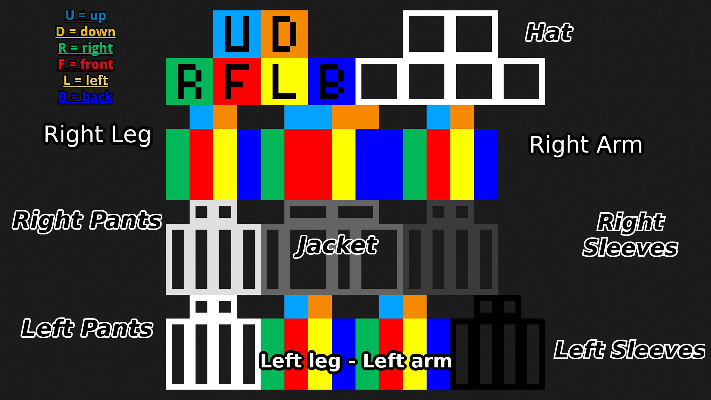
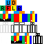
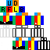

# Info
You can modify the sample files to create your skin with any image manipulation software.
If using something like Krita or GIMP be sure to change the brush settings to 1px and 100% hardness.

Check below for the reference layout.

**REMEMBER TO SAVE THE FILE AS .png AND WITH SIZE 64x64 pixels (height and width)**

~~~
# File structure

.
├── layout.png
├── sample_layout_3px_Alex.png
└── sample_layout_4px_Steve.png
├── Luanti.d
└── Minecraft.d

~~~

## Layout.png
This image explains the layout of the Minecraft skin structure (body's elements location etc...)
You can follow along and create your skin (without using third party services).

## Sample_layout_3px_Alex

The Alex variant sample, use this if you want the Slim arms version.

## Sample_layout_4px_Steve

The Steve variant sample, use this if you want the standard/legacy skin.

